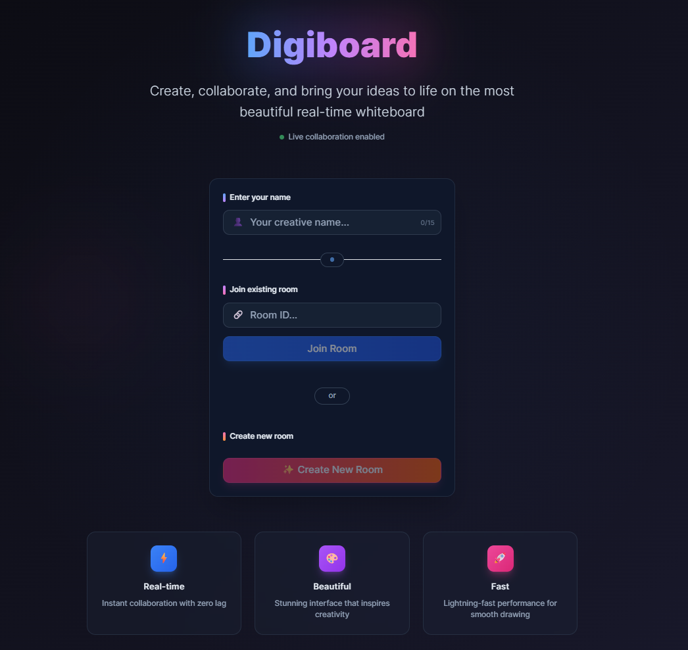
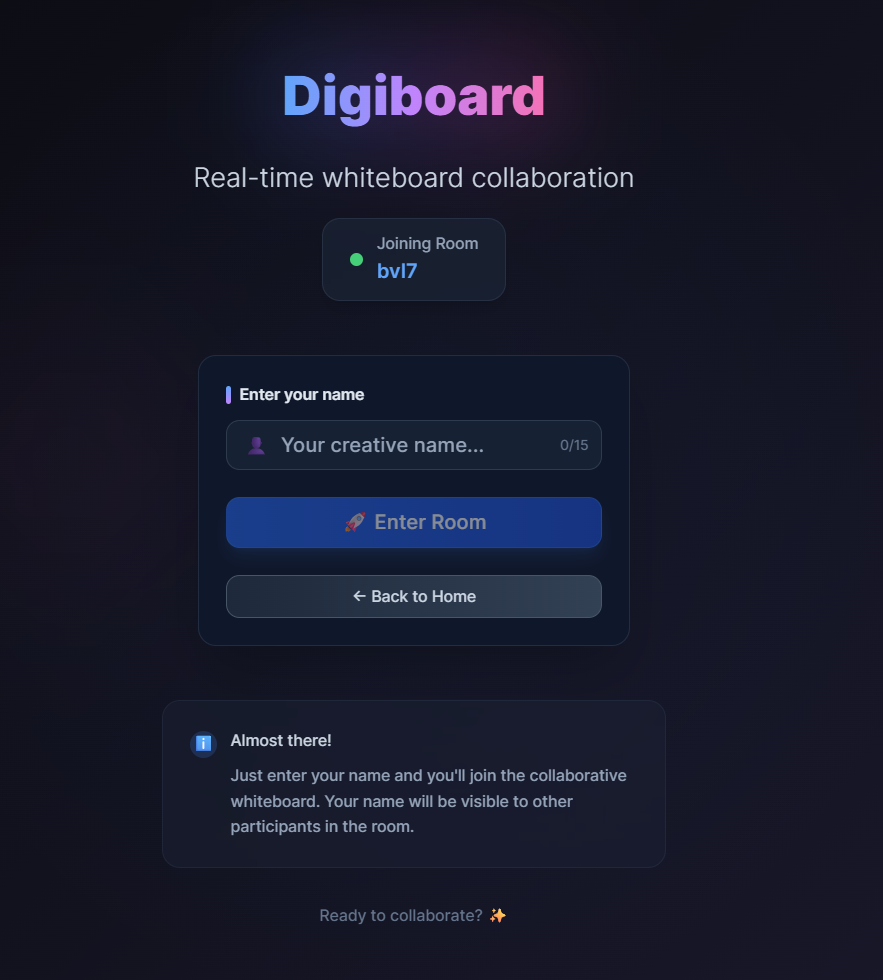
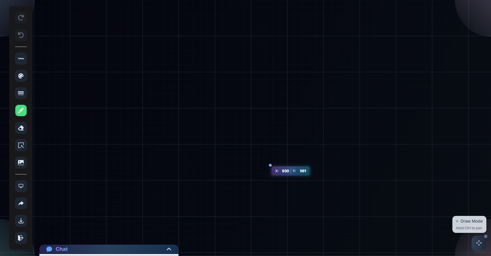
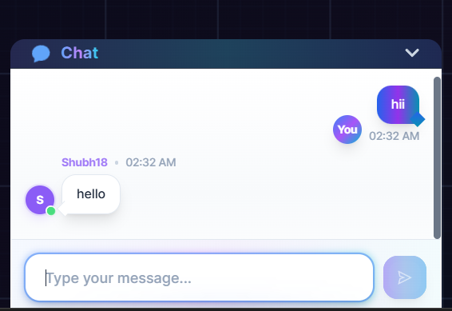
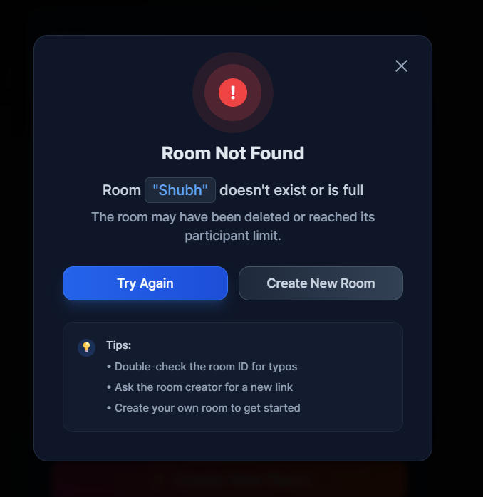

# SyncScribble



A powerful real-time collaborative whiteboard application that enables seamless drawing, sketching, and visual brainstorming. SyncScribble provides an intuitive platform where multiple users can collaborate instantly with comprehensive drawing tools, real-time synchronization, and integrated communication features.

Live Demo: [syncscribble.onrender.com](https://syncscribble.onrender.com/)

## 📸 Screenshots

<div align="center">
  
  <p><em>Clean and modern home page interface</em></p>
  <br><br/>
</div>

<div align="center">
  
  <p><em>Intuitive room creation and joining interface</em></p>
  <br><br/>
</div>

<div align="center">
  
  <p><em>Feature-rich collaborative whiteboard with advanced drawing tools</em></p>
  <br><br/>
</div>

<div align="center">
  
  <p><em>Real-time chat integration for seamless team communication</em></p>
  <br><br/>
</div>

<div align="center">
  
  <p><em>Custom 404 page with elegant design</em></p>
</div>


## 🔮 Features

- 🎨 **Real-Time Collaborative Drawing:** Multiple users can draw simultaneously with instant synchronization
- 🚀 **Unique Room System:** Create and join rooms with secure room IDs for team collaboration
- ✏️ **Advanced Drawing Tools:** Pen, eraser, shape drawing with precision controls
- 🔳 **Comprehensive Shape Library:** Circles, rectangles, polygons, lines, and custom shapes
- 🎨 **Dynamic Color System:** Custom color picker with brush size controls
- 🖼️ **Image Integration:** Drag, drop, and manipulate images directly on the canvas
- 💬 **Integrated Real-time Chat:** Communicate with team members while drawing
- ♻️ **Smart Undo/Redo:** Intelligent history control for seamless workflow
- 💾 **Canvas Export:** Download collaborative artwork as high-quality PNG files
- ⚡ **WebSocket Synchronization:** Lightning-fast real-time updates across all connected users
- 📱 **Responsive Design:** Optimized for desktop, tablet, and mobile devices
- 🎭 **Smooth Animations:** Framer Motion powered transitions and interactions
- 🖱️ **Intuitive UI/UX:** Clean interface with tooltips and visual feedback
- 🔐 **Secure Collaboration:** Protected room access with unique identifiers
- 🚫 **Error Handling:** Robust 404 pages and connection management
- 🎯 **TypeScript Support:** Fully typed for enhanced development experience

## 🚀 Live Preview

You can view the live preview of the project [here](https://syncscribble.onrender.com/).

## 💻 Tech Stack


## ⚙️ Installation

1. **Fork this repository:** Click the Fork button located in the top-right corner of this page.
2. **Clone the repository:**
   ```bash
   git clone https://github.com/shubh-garg18/SyncScribble.git
   ```
3. **Navigate to the project directory:**
   ```bash
   cd SyncScribble
   ```
4. **Install dependencies:**
   ```bash
   npm install
   ```
5. **Set up environment variables (if needed):**
   Create a `.env.local` file in the root directory:
   ```bash
   # Add any required environment variables
   NEXT_PUBLIC_APP_NAME=SyncScribble
   ```
6. **Start the development server:**
   ```bash
   npm run dev
   ```
7. **Access the application:**
   Open your browser and navigate to:
   ```
   http://localhost:3000
   ```

## 📁 Available Scripts

| Script  | Description                      |
|---------|----------------------------------|
| `dev`   | Start the development server     |
| `build` | Build the app for production     |
| `start` | Launch the production server     |
| `lint`  | Lint the code using ESLint       |

## 🎨 Usage Guide

### Creating a Room
1. Visit the homepage at [syncscribble.onrender.com](https://syncscribble.onrender.com/)
2. Click "Create Room" to generate a unique room ID
3. Share the room ID with your collaborators
4. Start drawing and collaborating in real-time!

### Joining a Room
1. Enter the room ID provided by the room creator
2. Click "Join Room"
3. You'll be instantly connected to the collaborative whiteboard

### Drawing Tools
- **Pen Tool:** Free-hand drawing with customizable colors and brush sizes
- **Shape Tools:** Draw perfect circles, rectangles, polygons, and lines
- **Eraser:** Remove unwanted elements with precision
- **Color Picker:** Choose from preset colors or create custom colors
- **Brush Size Control:** Adjust stroke width for different drawing needs
- **Image Upload:** Drag and drop images directly onto the canvas

### Advanced Features
- **Undo/Redo:** Smart history management for better workflow control
- **Canvas Export:** Download your collaborative artwork as PNG files
- **Real-time Chat:** Communicate with team members without leaving the canvas
- **Responsive Design:** Seamless experience across all devices

## 🤝 Contributing

We welcome contributions! Please follow these steps:

1. Fork the repository
2. Create a feature branch (`git checkout -b feature/amazing-feature`)
3. Commit your changes (`git commit -m 'Add amazing feature'`)
4. Push to the branch (`git push origin feature/amazing-feature`)
5. Open a Pull Request

### Development Guidelines
- Follow TypeScript best practices
- Maintain responsive design principles
- Test real-time functionality thoroughly
- Keep animations smooth and purposeful
- Ensure accessibility standards are met

## 📄 License

This project is licensed under the MIT License - see the [LICENSE](LICENSE) file for details.

## 🌟 Support Us

If you find SyncScribble helpful or valuable, please consider 🌟 starring the repository. It helps us gain visibility and encourages further development of collaborative tools.

## 🙏 Acknowledgments

Special thanks to:

- **Next.js** for the powerful React framework:
  - [Next.js Repository](https://github.com/vercel/next.js)
  - [Next.js Documentation](https://nextjs.org/docs)

- **Socket.IO** for enabling real-time communication:
  - [Socket.IO Repository](https://github.com/socketio/socket.io)
  - [Socket.IO Documentation](https://socket.io/docs/)

- **Recoil** for elegant state management:
  - [Recoil Repository](https://github.com/facebookexperimental/Recoil)

- **Framer Motion** for smooth animations:
  - [Framer Motion Documentation](https://www.framer.com/motion/)

### 📫 Get in Touch:

GitHub: [@shubh-garg18](https://github.com/shubh-garg18)
<br><br/>
Project Repository: [SyncScribble](https://github.com/shubh-garg18/SyncScribble)
<br><br/>


---

*Built with ❤️ by Shubh Garg*
